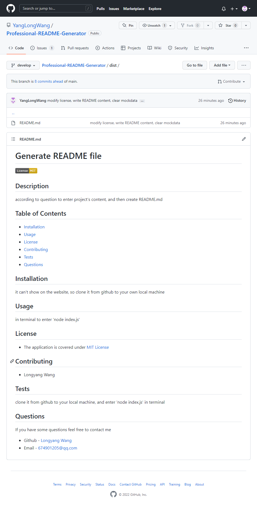

# Generate README Generator 
<a href="dist/README.md" target="_blank">Check the Generated README.md Sample</a>

## Description 

You can quickly and easily generate a README file by using a command-line application to generate one. This allows the project creator to devote more time working on the project.

## Table of Contents 

- [Overview](#overview)
  - [Installation](#installation)
  - [Usage](#usage)
  - [Tests](#tests)
  - [The challenge](#the-challenge)
  - [Screenshot](#screenshot)
  - [Video](#video)
  - [Links](#links)
- [My process](#my-process)
  - [Built with](#built-with)
  - [What I learned](#what-i-learned)
- [Contributing](#contributing)
- [Questions](#questions)

## Overview
### Installation 

Because this is a Node.js application that runs from a machine and not a browser, I can't deploy this to GitHub pages. If anyone ever wants to look at the application, you have to clone it to your own local machine and run it from there.

### Usage 

The application will be invoked by using the following command: node index.js

### Tests 

Clone it to your own local machine and enter node index.js.

### The challenge

Users should be able to:

- enter any content of project according to the questions.
- choose a license from the question list of license.
- click the license badge at the top of the generated README file or license link in the license section of README file if you choose a license.

### Screenshot



### Video

- Video link: [https://drive.google.com/file/d/1z8N8uxMNyLIEZSeYGOtwG6icuzZDdNsB/view](https://drive.google.com/file/d/1z8N8uxMNyLIEZSeYGOtwG6icuzZDdNsB/view)

### Links

- Solution URL: [https://github.com/YangLongWang/Professional-README-Generator](https://github.com/YangLongWang/Professional-README-Generator)

## My process

### Built with

- JavaScript


### What I learned

- according to inquirer doc to set question type
- using promise 


To see how I add code snippets, see below:

```JS
const questions = [
  {
    type: 'input',
    name: 'name',
    message: 'What is your name? (Required)',
    validate: nameInput => {
        if (nameInput) {
            return true;
        } else {
            console.log('Please enter your name!');
            return false;
        }
    }
  }
]

init()
    .then(projectData => {
        return generateMarkdown(projectData);
    })
    .then(contentData => {
        return writeToFile(contentData);
    })
    .catch(err => {
        console.log(err);
    })
```

## Contributing 
- Longyang Wang

## Questions
if you have some questions feel free to contact me
- Github - [Longyang Wang](https://github.com/YangLongWang)
